Connect to AWS by using AWS CLI,

AWS configure

provide AWS access key and region to deploy the resources on.

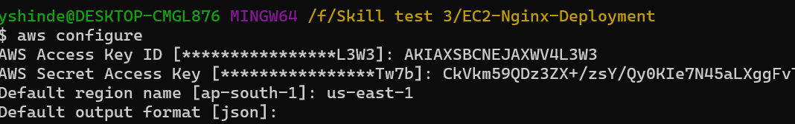

Execute the command below to check connectivity with AWS account,

aws sts get-caller-identity

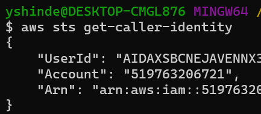

Create terraform files in the project directory.

Find the latest Ubuntu 20.04 LTS AMI

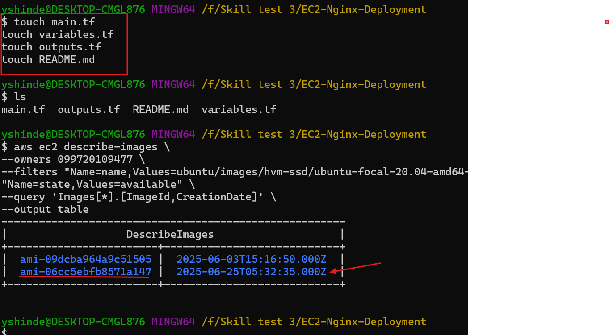

Write the code in main.tf and variables.tf file.

Create variables.tf

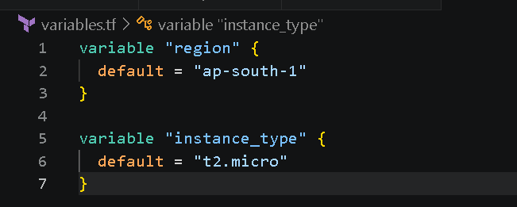

Create main.tf and add AWS provider

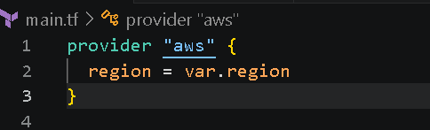

To get the latest image of Ubuntu 20.04 LTS AMI add in the code,

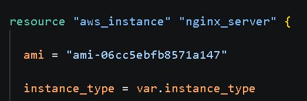

For the default VPC

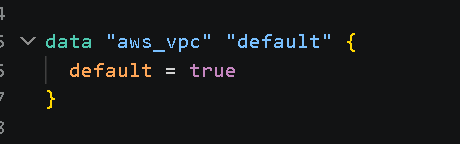

Create a security group

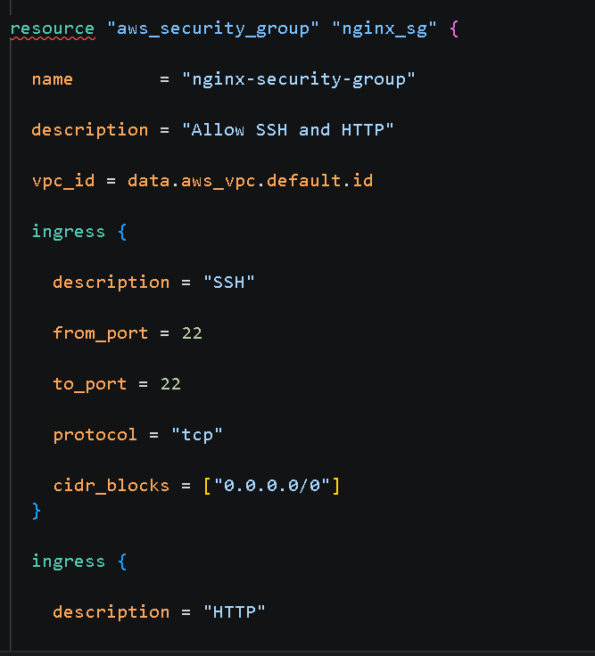

User Data Script

When EC2 boots for first time:

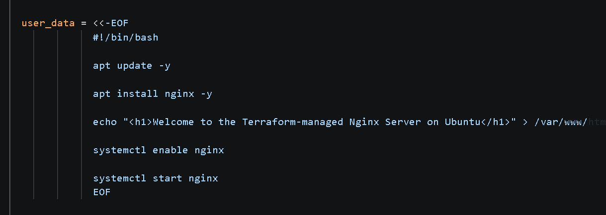

Create outputs.tf

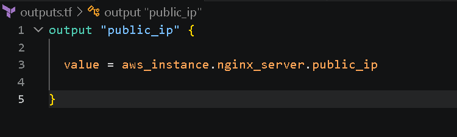

Initialize terraform

terraform init

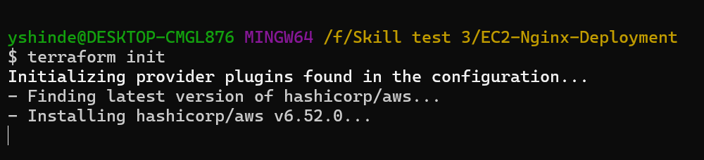

Validate Terraform

terraform validate

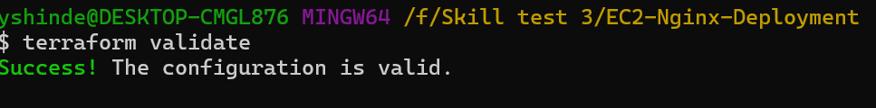

Execute the command to run the terraform plan and get the output in a file

terraform plan -out=tfplan

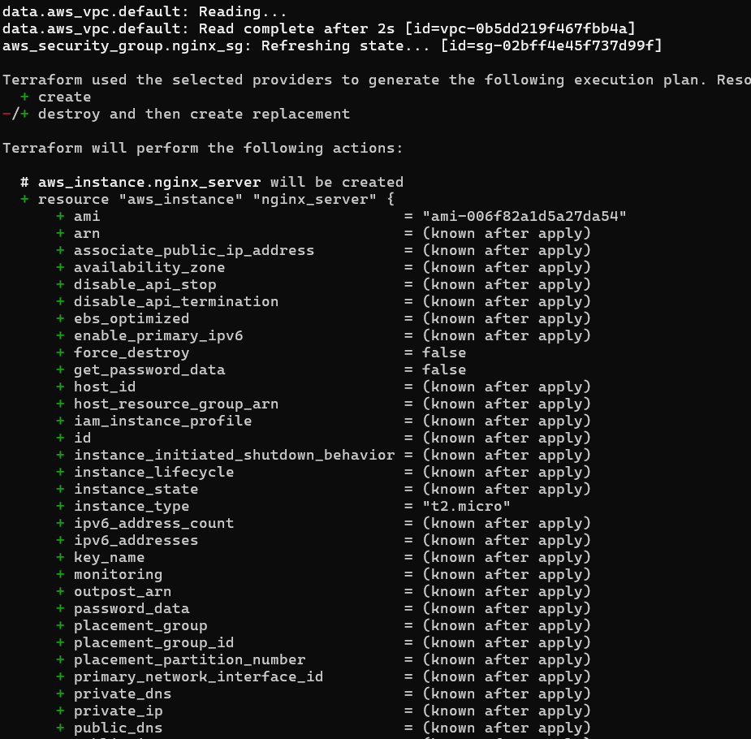

Apply the plan to execute and deploy resources to AWS,

terraform apply "tfplan"

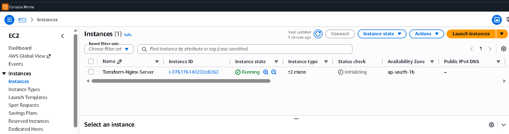

Verify EC2

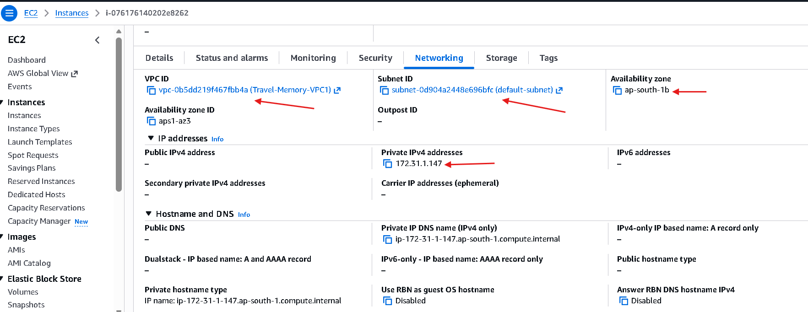

Verify Security group

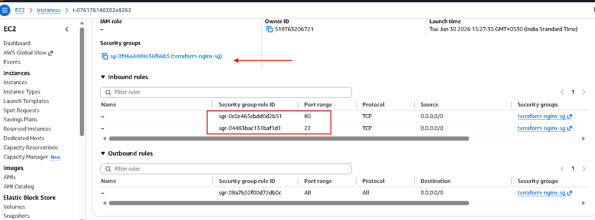

Delete all resources once project is completed.

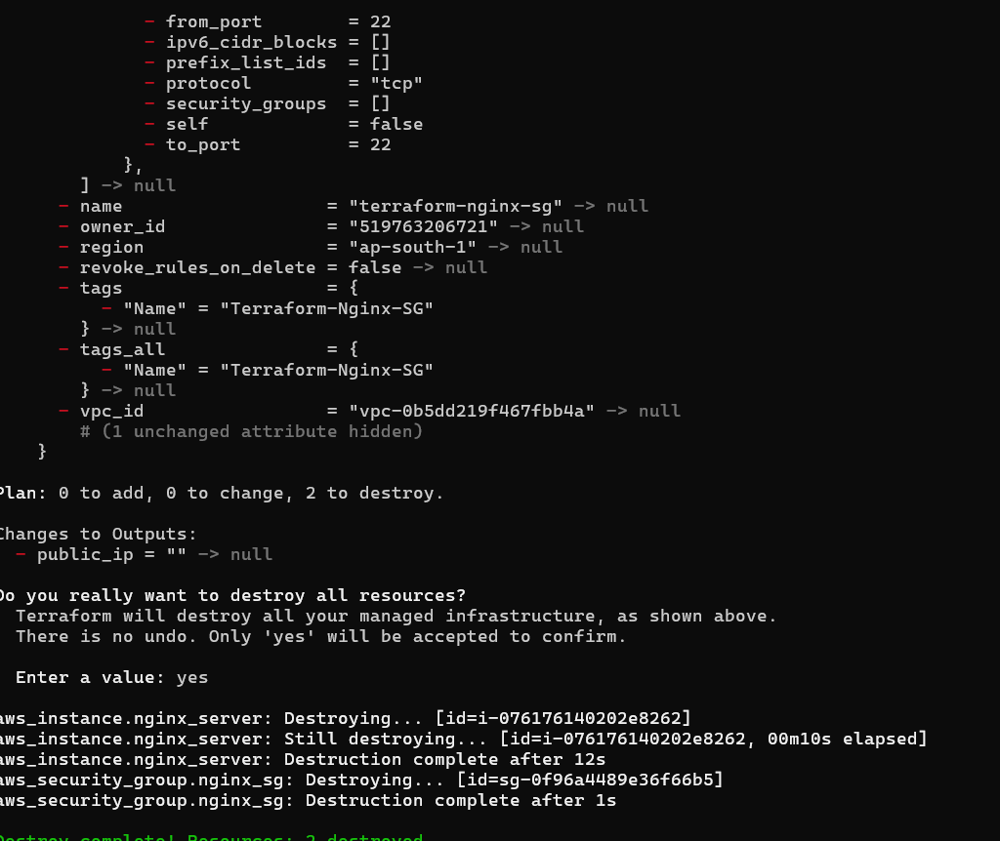

Output of the Public IP address couldn't be taken as there was some issue with AWS services after the deployment of the EC2 instance. The public Ip address was seen in the AWS portal but output couldn't be displayed.

